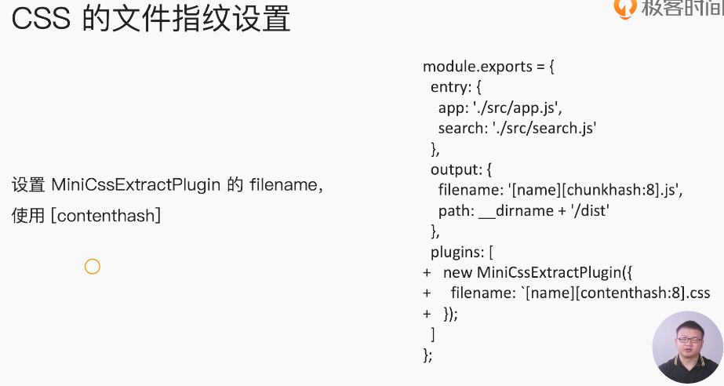
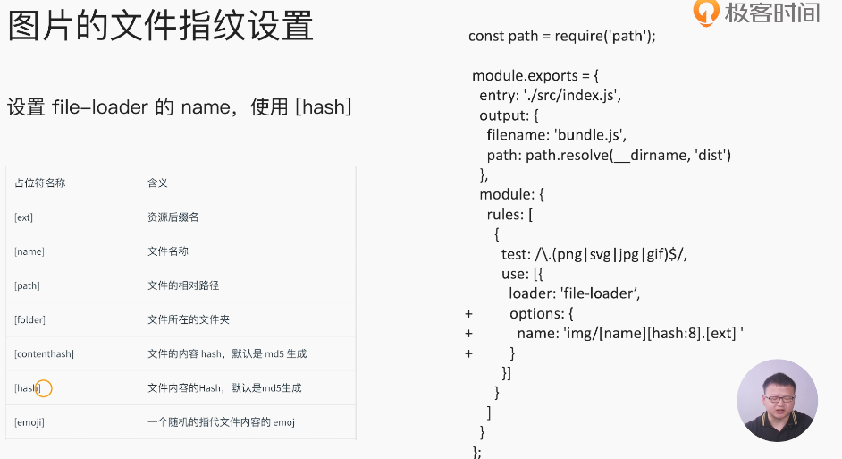
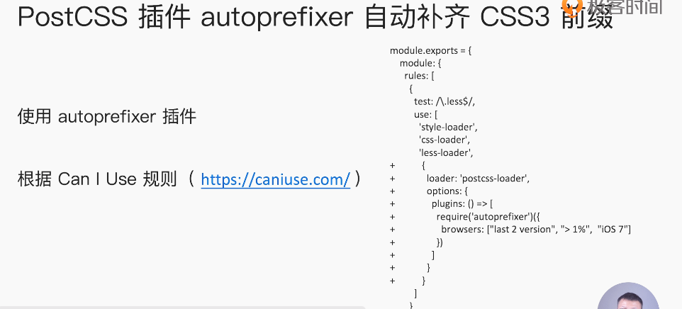
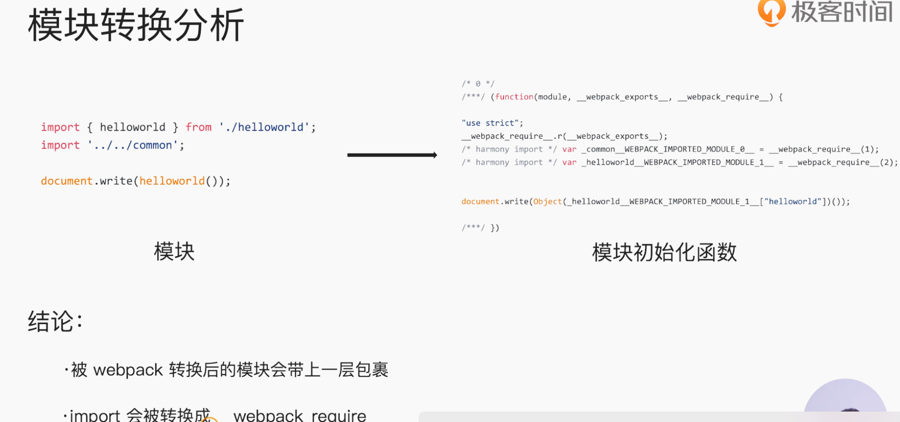
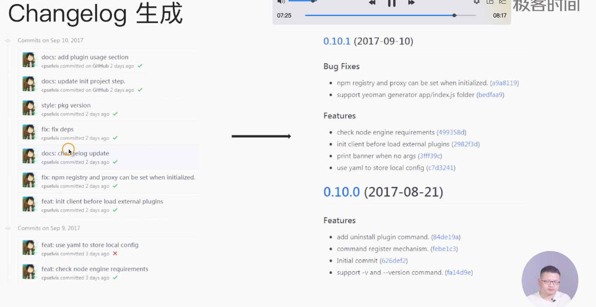

# webpack4.X


### 构建工具作用

- 装换ES6+语法 兼容低版本的浏览器
- 转换JSX React和Vue的语法
- CSS前缀补全，预处理器
- 压缩混淆
- 图片处理


### 前端构建的历史


打包工具的选择指标

- 社区生态
- 配置灵活 和插件扩展
- 官方迭代的速度

### 基础配置

0配置默认：你不用配置，直接可以用的，就是给你的默认配置

- entry：`./src/index.js`
- output: `./dist/main.js`

```sh
# webpack.config.js
webpack --config
```

```js
//  webpack.config.js
module.exports = {
  // 1. 打包入口文件
  entry:"./src/index.js",
  // 2. 打包后的资源出口
  output:'./dist/main.js',
  // 3. 环境， production development
  mode:'production',
  // 4. 模块处理，loader的配置
  module: {
    rules: [
      {test:/\.txt$/,use:'raw-loader'}
    ]
  },
  // 5. 插件的配置
  plugins: [
    new HtmlwebpackPlugin({
      template:'./src/index.html'
    })
  ]
}
```


### 核心概念

- entry

依赖的入口，非代码的依赖：图片，字体不断加入到依赖树中

```js
// 单入口：适合单页应用
entry:"./src/index.js"
// 多入口
entry: {
  app:'./src/app.js',
  search:'./src/search.js'
}
```

- output

```js
output: {
  filename:'[name].js', //  【name】是占位符，制定打包后的文件名称
   path:__dirname+'/dist'
}
```


- loaders

webpack默认支持js和json文件类型，通过loaders去支持其他文件的类型并且将他们转成有效的模块，添加到依赖中。

本身是一个函数，接受源文件作为参数，返回转换的结果。

1. babel-loader
2. css-loader
3. less-loader
4. ts-loader
5. file-loader 图片，字体打包
6. raw-loader 将文件以字符串的形式导入
7. thread-loader 多进程打包js和css 加快打包速度

```js
module: {
  rules:[
    {test:/.txt$/,use'raw-loader'}
  ]
}
```

- plugins

  插件作用文件的优化，将资源和环境变量注入

  作用于整个构建过程

  

  1. CommonsChunckPlugin 将chunks相同的代码提取成公共的js
  2. CleanWebpackPlugin 清理构建目录
  3. ExtractTextWebpackPlugin 
  4. Html

- mode

  1. `production`
  2. `development`

  

  ```js
  ```

  

### 具体配置

**通过babel解析ES6**

babel-loader

- `.babelrc` babel的配置文件
- **babel-loader：**使用Babel和webpack来转译JavaScript文件。
- **@babel/preset-react：**转译react的JSX
- **@babel/preset-env：**转译ES2015+的语法
- **@babel/core：**babel的核心模块

```sh
npm i @babel/core @babel/preset-env babel-loader -D
```


- **解析CSS**

  ```js
  {
    test:/.css$/,
      use:[
        'style-loader',
        'css-loader'
      ]
  }
  ```

  

  

less文件

> less  less-loader

```js
{
  test:/.less$/,
    use:[
      'style-loader',
      'css-loader',
      'less-loader'
    ]
}
```


### 文件处理

> 图片，字体


url-loader


###  webpack文件监听

文件监听是发生文件变化汇总，自动投建出新的文件

- `--watch` 每次都要手动刷新浏览器
- webpack.config.js watch

>  监听文件变化机制 **轮询监听文件**


### 热更新

>  webpack-dev-server
>
> HotModuleReplacementPlugin
>
> 结合使用

WDS 不刷新浏览器，输出的内容放在内存中

中间件


## **热更新原理**


## 文件指纹(important)

> 版本管理，
>
> 浏览器缓存

1. Hash: 文件内容改变，整个项目构建的的hash值改变

2. Chunkhash： 不同的entry生成不同的chunkhash

3. Contenthash:根据文件内容定义

### JS文件指纹

chunkhash

```js
output: {
  path:path.join(__driname,'dist'),
    filename:'[name]_[chunkhash:8].js'
}
```


#### CSS文件和图片文件指纹的设置






将css提取成独立的文件

```sh
yarn add mini-css-extract-plugin -D
```

`style-loader`和`MiniCssExtractPlugin.loader`的作用是相反的，不可以同时使用。


### 文件的压缩


### 自动清除构建产物

打包新的产物自动清理

```sh
rm -rf dist
```

插件

`clean-webpack-plugin`

### css前缀处理

> caniuse.com




```sh
yarn add postcss-loader autoprefixer -D
```

### 处理移动端css转rem

```sh
// 处理移动端布局
yarn add lib-flexible -S
yarn add px2rem-loader -D
```

### 静态资源内联

代码层面

- 页面框架的初始化脚本
- 上报相关打点
- css内联避免页面闪动

### 请求层面:减少http请求次数

- 小图盘或者字体 url-loader


css内联

# 多页面打包方案

- MPA: seo友好

- SPA：

#### 方案一:

动态获取entry和设置html-webpack-plugin


```js
const setMPA = () => {
    const entry = {};
    const htmlWebpackPlugins = [];
    // 所有页面的入口index.js
    const entryFiles = glob.sync(path.join(__dirname, './src/*/index.js'))
    Object.keys(entryFiles).map((index) => {
        const entryFile = entryFiles[index]
        const match = entryFile.match(/src\/(.*)\/index\.js/ig)
        const pageName = match && match[1];
        entry[pageName] = entryFile;
        htmlWebpackPlugins.push(
            new HtmlWebpackPlugin({
                template: `src/${pageName}/index.html`,
                filename: `${pageName}.html`,
                chunks: [pageName],
                inject: true,
                minify: {
                    html5: true,
                    collapseWhitespace: true,
                    preserveLineBreaks: false,
                    minifyCSS: true,
                    minifyJS: true,
                    removeComments: false
                }
            }),
        )
    })
    return {
        entry,
        htmlWebpackPlugins
    }
}
const { entry, htmlWebpackPlugins } = setMPA();
```


### 基础库的分离


### SplitChunksPlugin进行公共脚本的分离???

引用了同一个脚本

- async
- initial
- all (推荐)所有引入的库进行分离


### sourcemap

将


### TreeShaking


必须是ES6语法，不支持CJS。

- 只能做顶层语句出翔
- import的模块只能是常量
- import binding是immutable的

 **webpack中的`mode`**

- production默认开启treeshaking


### scopeHoisting的使用

原理：将所有模块代码按照引用顺序放在一个函数的作用域里，然后适当的重命名

一些变量防止变量名冲突。

对比：通过scope hoisting减少声明代码和内存开销

```js
// es6的代码
// mode production默认开启
```


> 构建后存在大量的闭包代码,大量函数闭包裹代码
- import被转为 _webpack_require




### 代码分割

chunks 语块 有效的加快`首屏渲染速度`

- 懒加载脚本

```js
// cjs: require.ensure
// es6动态import(babel转换)
// @babel/plugin-syntax-dynamic-import
```


- 抽离相同的代码到共享块


### ESLint和webpack加强代码规范

代码规范

- eslint-config-airbnb (base) 含有react
- eslint-config-alloy

**建议**

1. 基于eslint:recommend配置改进

2. 帮助发现代码错误的规则，全部开启

3. 保持代码风格一直，而不是限制开发体验

```js
for-direction error 
```

**集成CI/CD和webpack集成**


制定解析器

```js
yarn add eslint eslint-plugin-import eslint-plugin-react eslint-plugin-jsx-a11y -D
```


```js
babel-eslint
```


### webpack打包组件库

rollup更适合打包组件库

案例

大整数加法库的打包

- 需要打包压缩版本和非压缩版本
- 支持AMD和CJS和ESM模块引入


```js
const TerserPlugin = require('terser-webpack-plugin');
module.exports = {
    // 不开启压缩
    mode: 'none',
    entry: {
        'large-number': './src/index.js',
        'large-number.min': './src/index.js'
    },
    output: {
        filename: '[name].js',
        library: 'largeNumber',
        libraryTarget: 'umd',
        libraryExport: 'default',
    },
  	// 在这里开启压缩，压缩对应的文件
    optimization: {
        minimize: true,
        minimizer: [new TerserPlugin({
            include: /\.min\.js$/,
        })]
    }
}
```

###### 发布到npm

1. 创建npm用户账号`用户名` `邮箱` `密码`
2. 在本地

```sh
npm adduser
# 设置对应用户的信息
npm publish # 发布包
```


### SSR

- 所有的模板资源存储在服务端

- 内网机器拉取数据更快

- 一个HTML返回所有的数据（首屏数据）

优点

1. 减少白屏时间
2. 对于SEO友好 （利于爬虫分析）

服务端

- `react-dom/server`的renderToString方法将React字符串渲染成字符串
- 服务端返回对应的模板

客户端

	- 打包出服务端组件


#### SSR错误

`window is not defined错误`

`documnet is not defined`错误

```js
if(typeof window === 'undefined') {
  global.window = {};
}
```


`css in js`?

占位符的思路解决样式不显示的问题？

- 首屏数据

```html
<!--INTIAL_DATA_PLACEHOLDER-->
```


### 构建的日志信息输出的优化

stats： webpack中的控制信息的输出


```friendly-error-webpack-plugin`` 

- sucess:构建成功
- warning: 构建警告日志
- error错误


### 构建异常和中断处理


### 打包的文件的配置


### 项目的目录结构

> https://docs.qq.com/mind/DUG5ObGhleFJUZ3Bs


> 常见loader
>
> https://webpack.docschina.org/loaders/


## 测试

### 冒烟测试 smoke testing

正式测试之前的预测试；

目的：暴露导致软件需要重新发布的基本功能失效的严重问题。

**关注**

1. 构建是否成功

2. 每次构建完成build目录是否有内容输出

- 是否有js, css等静态资源文件
- 是否有HTML文件


mocha

一款测试框架

### 单元测试


## 持续集成的作用

优点

- 快速发现错误

- **防止分支大幅度偏离主干** 

流行的CI

Travis CI


```sh
language
```


>  github action ???
>
> travis ci


### git commit的规范 (angular js的提交git日志规范)

> husky 

- 加快CR流程
- 根据git commit生成changelog


```sh
<type>(<scope>): <subject>
```

- `feat`
- `fix`: 修复bug
- `docs`: 仅仅修改了文档
- `style`:空格，格式缩进等,不改变逻辑
- `refactor`:
- `perf`
- `test`
- `chore`:改变构建流程，或者增加依赖库，工具
- `revert`




### 版本规范


### webpack的优化构建速度和打包体积

1. **内部的stats** 

> 缺点：颗粒度太大，看不出问题所在

```js
"build:stats":"webpack --env production --json > stats.json"
```

2. 速度分析

```sh
speed-measure-webpack-plugin
```

2. 体积分析

```sh
webpack-bundle-anayzer
```


